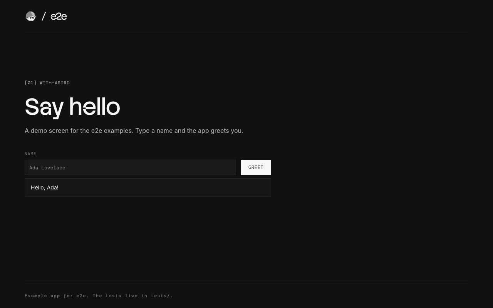
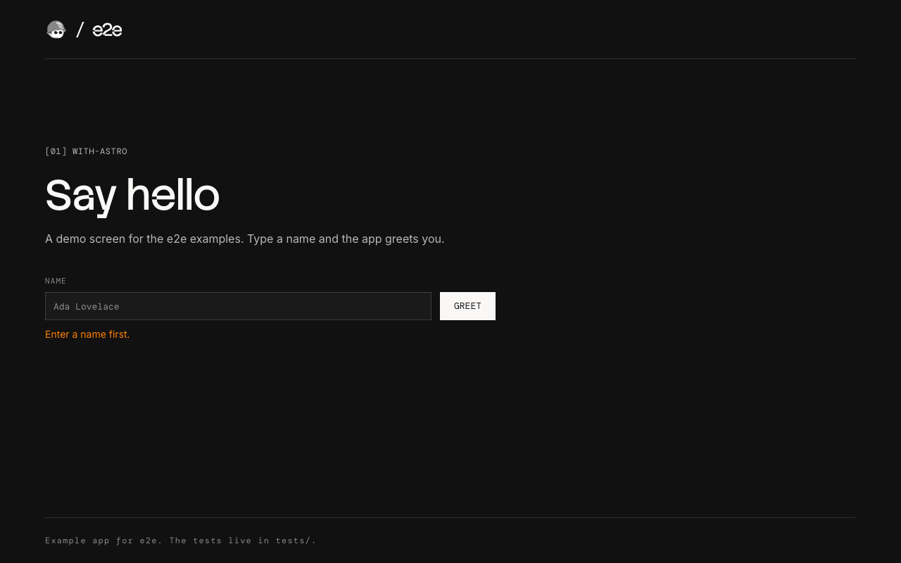

# e2e with Astro

An Astro greeting page with three locator tests and two agent tests. The
page ships no UI framework: one `<script>` in
[src/pages/index.astro](src/pages/index.astro) handles the form.





## Run

Use Node 22.22.3+, 24.8+, or 26+. From this folder:

```bash
npm install
npm run test:e2e
```

The runner starts the app at `http://localhost:4321`.
It downloads Chromium on the first run if needed.

## Agent tests

Set a [Vercel AI Gateway](https://vercel.com/docs/ai-gateway) key:

```bash
AI_GATEWAY_API_KEY="your-key" npm run test:e2e
```

Without the key, the agent tests skip. Add `-- --no-cache` to use fresh
model calls. Results are in `.e2e/report.json`.

See [e2e.config.ts](e2e.config.ts) and [tests/](tests/) for the setup.
For your own app, follow the [Quickstart](https://e2e.tester.army/docs/quickstart).

Last checked with e2e 0.18.0, @e2e-dev/web 0.13.0, Astro 7.3, and Node 22.
